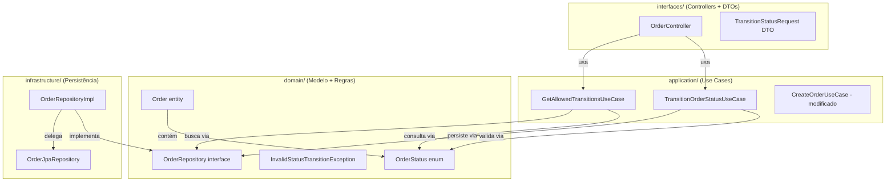

# Design — Fluxo de Status de Pedidos

## Visão Geral

Este documento descreve o design técnico para implementação do fluxo de status nos pedidos, onde cada pedido transita sequencialmente entre os estados: **PENDENTE → CONFIRMADO → ENVIADO → ENTREGUE**. A solução adiciona uma máquina de estados no domínio, um use case dedicado para transição, um endpoint PATCH para a API REST e validação rigorosa das transições permitidas.

A abordagem segue a arquitetura hexagonal já existente no projeto, mantendo a lógica de transição no domínio (`domain/`) e expondo a funcionalidade via camada de interfaces (`interfaces/`).

## Arquitetura

A feature se integra às camadas existentes da seguinte forma:



### Decisões de Design

1. **Enum `OrderStatus` com mapa de transições**: A lógica de quais transições são válidas fica encapsulada no próprio enum, usando um `Map<OrderStatus, OrderStatus>`. Isso mantém a regra de negócio no domínio e facilita a extensão futura.

2. **Endpoint PATCH separado**: Em vez de reutilizar o PUT existente, criamos `PATCH /api/v1/orders/{id}/status` para tornar a transição de status uma operação explícita e atômica, conforme Requisito 4.

3. **Exceção de domínio específica**: `InvalidStatusTransitionException` é uma exceção de domínio que carrega o status atual e o status solicitado, permitindo mensagens de erro claras (Requisito 3).

4. **Status inicial forçado**: O `CreateOrderUseCase` será modificado para ignorar o campo `status` da requisição e sempre atribuir `PENDENTE` (Requisito 5).

## Componentes e Interfaces

### 1. `OrderStatus` (Enum de Domínio)

**Pacote:** `com.brasilprev.orders.domain.model`

```java
public enum OrderStatus {
    PENDENTE, CONFIRMADO, ENVIADO, ENTREGUE;

    // Mapa de transições válidas: status atual → próximo status permitido
    private static final Map<OrderStatus, OrderStatus> TRANSITIONS = Map.of(
        PENDENTE, CONFIRMADO,
        CONFIRMADO, ENVIADO,
        ENVIADO, ENTREGUE
    );

    public boolean canTransitionTo(OrderStatus target);
    public Optional<OrderStatus> getNextStatus();
    public static OrderStatus fromString(String value);
}
```

- `canTransitionTo(target)`: retorna `true` se a transição do status atual para `target` é permitida.
- `getNextStatus()`: retorna o próximo status válido, ou `Optional.empty()` para `ENTREGUE`.
- `fromString(value)`: converte string para enum, lançando `IllegalArgumentException` para valores inválidos.

### 2. `InvalidStatusTransitionException` (Exceção de Domínio)

**Pacote:** `com.brasilprev.orders.domain.exception`

```java
public class InvalidStatusTransitionException extends RuntimeException {
    private final String currentStatus;
    private final String requestedStatus;

    // Mensagem: "Transição de status inválida: <atual> → <solicitado>"
}
```

### 3. `TransitionOrderStatusUseCase` (Caso de Uso)

**Pacote:** `com.brasilprev.orders.application.usecase`

```java
@Service
public class TransitionOrderStatusUseCase {
    public Order execute(Long orderId, OrderStatus newStatus);
    // 1. Busca o pedido (404 se não encontrado)
    // 2. Valida a transição via OrderStatus.canTransitionTo()
    // 3. Atualiza o status e persiste
    // Lança InvalidStatusTransitionException se inválida
}
```

### 4. `GetAllowedTransitionsUseCase` (Caso de Uso)

**Pacote:** `com.brasilprev.orders.application.usecase`

```java
@Service
public class GetAllowedTransitionsUseCase {
    public List<OrderStatus> execute(Long orderId);
    // 1. Busca o pedido (404 se não encontrado)
    // 2. Retorna lista com o próximo status, ou lista vazia para ENTREGUE
}
```

### 5. `TransitionStatusRequest` (DTO)

**Pacote:** `com.brasilprev.orders.interfaces.dto`

```java
public class TransitionStatusRequest {
    @NotBlank(message = "Status é obrigatório")
    private String status;
}
```

### 6. Endpoints no `OrderController`

Dois novos endpoints adicionados ao controller existente:

| Método | Path | Descrição |
|--------|------|-----------|
| `PATCH` | `/api/v1/orders/{id}/status` | Transiciona o status do pedido |
| `GET` | `/api/v1/orders/{id}/status/transitions` | Lista transições permitidas |

### 7. `GlobalExceptionHandler` (Modificação)

Adicionar handler para `InvalidStatusTransitionException` retornando HTTP 422 com `ApiResponse.error(...)`.

### 8. `CreateOrderUseCase` (Modificação)

Modificar para ignorar o campo `status` da requisição e sempre usar `OrderStatus.PENDENTE`.

## Modelos de Dados

### Entidade `Order` (Modificação)

O campo `status` muda de `String` para o enum `OrderStatus`:

```java
@Entity
@Table(name = "orders")
public class Order {
    @Id
    @GeneratedValue(strategy = GenerationType.IDENTITY)
    private Long id;

    @Column(nullable = false)
    private String customerName;

    @Enumerated(EnumType.STRING)
    @Column(nullable = false)
    private OrderStatus status;  // era String, agora é OrderStatus

    @Column(nullable = false)
    private BigDecimal totalAmount;

    @Column(nullable = false)
    private LocalDateTime createdAt;
}
```

### Tabela `orders` (Sem alteração de schema)

A coluna `status` já é `VARCHAR` e armazena strings. Com `@Enumerated(EnumType.STRING)`, o JPA persiste o nome do enum como string, mantendo compatibilidade.

| Coluna | Tipo | Descrição |
|--------|------|-----------|
| `id` | `BIGINT` (auto) | Identificador único |
| `customer_name` | `VARCHAR(255)` | Nome do cliente |
| `status` | `VARCHAR(255)` | Status do pedido (PENDENTE, CONFIRMADO, ENVIADO, ENTREGUE) |
| `total_amount` | `DECIMAL` | Valor total |
| `created_at` | `TIMESTAMP` | Data de criação |

### DTO `TransitionStatusRequest`

```json
{
  "status": "CONFIRMADO"
}
```

### Resposta de Sucesso (Transição)

```json
{
  "success": true,
  "data": {
    "id": 1,
    "customerName": "João Silva",
    "status": "CONFIRMADO",
    "totalAmount": 150.00,
    "createdAt": "2026-03-15T03:01:17"
  },
  "message": null
}
```

### Resposta de Erro (Transição Inválida — HTTP 422)

```json
{
  "success": false,
  "data": null,
  "message": "Transição de status inválida: PENDENTE → ENVIADO"
}
```

### Resposta de Transições Permitidas

```json
{
  "success": true,
  "data": ["CONFIRMADO"],
  "message": null
}
```

## Propriedades de Corretude

*Uma propriedade é uma característica ou comportamento que deve ser verdadeiro em todas as execuções válidas de um sistema — essencialmente, uma declaração formal sobre o que o sistema deve fazer. Propriedades servem como ponte entre especificações legíveis por humanos e garantias de corretude verificáveis por máquina.*

### Propriedade 1: Regra de transição de status

*Para qualquer* par (statusAtual, statusDestino) de valores do enum `OrderStatus`, `canTransitionTo(statusDestino)` deve retornar `true` se e somente se `statusDestino` é o próximo status sequencial imediato de `statusAtual` na cadeia PENDENTE → CONFIRMADO → ENVIADO → ENTREGUE. Isso implica que retrocessos, pulos de etapa e transições a partir de ENTREGUE são sempre rejeitados.

**Valida: Requisitos 2.1, 2.2, 2.3, 2.4, 2.5, 2.6**

### Propriedade 2: Resposta de erro para transição inválida

*Para qualquer* pedido existente e qualquer transição de status inválida (onde `canTransitionTo` retorna `false`), o endpoint PATCH deve retornar HTTP 422 e a mensagem de erro no `ApiResponse` deve conter tanto o status atual quanto o status solicitado.

**Valida: Requisitos 3.1, 3.2**

### Propriedade 3: Status inicial sempre PENDENTE

*Para qualquer* requisição de criação de pedido, independentemente do valor enviado no campo "status" (incluindo valores válidos como "CONFIRMADO", valores inválidos, ou nulo), o pedido resultante deve ter `status` igual a `PENDENTE`.

**Valida: Requisitos 1.2, 5.1, 5.2**

### Propriedade 4: Round-trip de persistência do status

*Para qualquer* pedido com qualquer `OrderStatus` válido, salvar o pedido no repositório e depois buscá-lo pelo ID deve retornar um pedido com o mesmo status.

**Valida: Requisito 1.3**

### Propriedade 5: Transição válida via endpoint atualiza o pedido

*Para qualquer* pedido em um status que não seja ENTREGUE, aplicar a transição para o próximo status válido via endpoint PATCH deve retornar HTTP 200 e o pedido retornado deve ter o novo status.

**Valida: Requisito 4.2**

### Propriedade 6: Consulta de transições permitidas é consistente com as regras

*Para qualquer* pedido em qualquer status, o endpoint GET de transições permitidas deve retornar uma lista que contém exatamente os status para os quais `canTransitionTo` retorna `true` (lista com um elemento para PENDENTE/CONFIRMADO/ENVIADO, lista vazia para ENTREGUE).

**Valida: Requisitos 6.1, 6.2**

## Tratamento de Erros

| Cenário | HTTP Status | Mensagem |
|---------|-------------|----------|
| Transição de status inválida | 422 Unprocessable Entity | `"Transição de status inválida: {atual} → {solicitado}"` |
| Pedido não encontrado | 404 Not Found | `"Order not found: {id}"` |
| Campo "status" ausente/em branco no body | 400 Bad Request | Mensagem de validação do Bean Validation |
| Valor de status não reconhecido no body | 400 Bad Request | `"Status inválido: {valor}. Valores permitidos: PENDENTE, CONFIRMADO, ENVIADO, ENTREGUE"` |
| Erro interno | 500 Internal Server Error | `"Internal server error"` |

### Implementação no `GlobalExceptionHandler`

Adicionar dois novos handlers:

1. **`InvalidStatusTransitionException`** → HTTP 422 com `ApiResponse.error(ex.getMessage())`
2. **`IllegalArgumentException`** (do `OrderStatus.fromString`) → HTTP 400 com `ApiResponse.error(ex.getMessage())`

O handler existente para `RuntimeException` continua tratando o caso de pedido não encontrado (404).

## Estratégia de Testes

### Testes Unitários (JUnit 5 + Mockito)

Testes unitários focam em exemplos específicos, edge cases e condições de erro:

- **`OrderStatus` enum**: verificar que contém exatamente 4 valores; verificar `fromString` com valor inválido
- **`TransitionOrderStatusUseCase`**: testar transição válida (mock do repositório); testar pedido não encontrado (404)
- **`GetAllowedTransitionsUseCase`**: testar retorno para cada status; testar pedido não encontrado
- **`CreateOrderUseCase`**: testar que status é forçado para PENDENTE
- **`GlobalExceptionHandler`**: testar resposta 422 para `InvalidStatusTransitionException`

Convenção de nomes: `deve_[resultadoEsperado]_quando_[condicao]`

### Testes de Propriedade (JUnit-Quickcheck)

Biblioteca escolhida: **junit-quickcheck** (compatível com JUnit 5 e o ecossistema Maven/Spring Boot do projeto).

Dependência Maven:
```xml
<dependency>
    <groupId>com.pholser</groupId>
    <artifactId>junit-quickcheck-core</artifactId>
    <version>1.0</version>
    <scope>test</scope>
</dependency>
<dependency>
    <groupId>com.pholser</groupId>
    <artifactId>junit-quickcheck-generators</artifactId>
    <version>1.0</version>
    <scope>test</scope>
</dependency>
```

Cada teste de propriedade deve:
- Executar no mínimo **100 iterações**
- Referenciar a propriedade do design via comentário no formato: `// Feature: order-status-flow, Property {N}: {título}`
- Cada propriedade de corretude é implementada por **um único** teste de propriedade

| Propriedade | Teste | Gerador |
|-------------|-------|---------|
| P1: Regra de transição | Gerar pares aleatórios `(OrderStatus, OrderStatus)` e verificar que `canTransitionTo` retorna `true` sse o destino é o próximo sequencial | Gerador de pares de `OrderStatus` |
| P2: Resposta de erro | Gerar pares inválidos e verificar HTTP 422 com mensagem contendo ambos os status | Gerador de pares inválidos de `OrderStatus` |
| P3: Status inicial PENDENTE | Gerar strings aleatórias para o campo status na criação e verificar que o pedido tem PENDENTE | Gerador de strings arbitrárias |
| P4: Round-trip persistência | Gerar pedidos com status aleatório, salvar e buscar, verificar igualdade | Gerador de `OrderStatus` |
| P5: Transição válida via endpoint | Gerar pedidos em status não-terminal, aplicar próxima transição, verificar 200 e status atualizado | Gerador de `OrderStatus` excluindo ENTREGUE |
| P6: Consulta de transições | Gerar pedidos em status aleatório, consultar transições, verificar consistência com `canTransitionTo` | Gerador de `OrderStatus` |

### Complementaridade

- **Testes unitários** capturam bugs concretos em exemplos específicos e edge cases (status inválido, pedido inexistente, body vazio)
- **Testes de propriedade** verificam que as regras de negócio valem universalmente para todas as combinações de entrada possíveis
- Juntos, garantem cobertura abrangente: os unitários pegam os casos óbvios, os de propriedade encontram os casos que não pensamos
